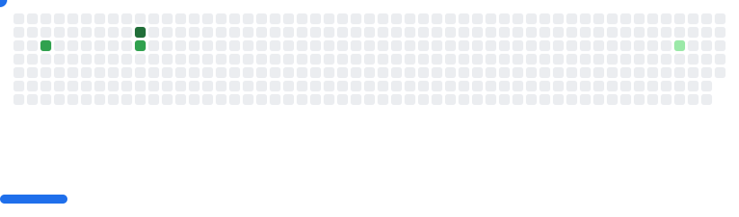

<!--  -->

  
  <strong>Welcome to my GitHub profile! Let's innovate and build together. 🚀</strong>

I'm a **Computer Science Engineering Graduate** and **Software Engineer** with **2+ years of experience** building and supporting **full-stack** and **frontend applications**.

I work primarily with React, Next.js, TypeScript, Node.js, NestJS, REST APIs, and .NET, with hands-on experience in microservices, Azure Service Bus, Microsoft Azure, AWS, CI/CD, and production support.

Currently working on enterprise applications involving frontend development, backend services, API integrations, cloud storage, debugging, and production workflows.

---

### 🛠️ **What I'm Currently Working On:**

- Developing and maintaining enterprise applications using **Angular, NestJS, and TypeScript**.
- Working on frontend and backend integrations involving **REST APIs and Azure Blob Storage**.
- Debugging and improving application workflows across frontend and backend services.
- Working with existing codebases and technical documentation to understand application architecture and integration flows.

---

### Experience:

- **Junior Full Stack Developer at DBiz AI Solutions** (Aug 2026 - Present): Working on frontend and backend development using Angular, NestJS, and TypeScript, with REST API and Azure Blob Storage integrations.

- **Frontend Developer at DBiz AI Solutions** (Jul 2026 - Aug 2026): Developed frontend applications using React, Next.js, and TypeScript, including reusable components, routing, dashboards, and REST API integrations.

- **Associate Full Stack Developer at DBiz AI Solutions** (Dec 2025 - Jul 2026): Developed and enhanced enterprise applications using React, TypeScript, Node.js, NestJS, and REST APIs, working with microservices and Azure Service Bus.

- **Graduate Trainee at DBiz AI Solutions** (May 2025 - Dec 2025): Developed full-stack applications using React, TypeScript, Node.js, Express.js, and NestJS, with hands-on experience in REST APIs, Azure Service Bus, AWS, Azure, CI/CD, and Agile development.

- **C# Developer Intern at Global Health Opinion** (Mar 2025 - May 2025): Developed backend functionality using C# and .NET, integrated REST APIs, and worked on application workflows involving authentication, verification, consent handling, and user onboarding.

- **Unity Developer Intern at PlatypusBox** (Nov 2024 - Feb 2025): Worked on Unity development using C#, cloud storage integration, external APIs, Android UI development, and application workflow optimization.

- **Technology Lead at IEDC, CE Poonjar** (Oct 2023 - Feb 2025): Led technical initiatives, mentored students, and guided projects focused on innovation and entrepreneurship.

---

# 💻 Tech Stack:
                                

### 📚 **What I'm Learning:**

- 💻 Deepening my knowledge of **full-stack development and scalable web applications**.
- ☁️ Expanding my understanding of **cloud architecture across Microsoft Azure and AWS**.
- 🧩 Strengthening my knowledge of **microservices, distributed systems, and backend development**.
- 🛠️ Improving my **system design, debugging, testing, and software engineering practices**.

---

## 🌐 Socials:
 
 
 
 
 

### 🔝 Top Contributed Repo

---

### 🤝 **Let's Collaborate:**
- Open to collaborating on **game development projects**, **web apps**, and **innovative tech solutions**.

---

  ## 💰 You can help me by Donating
   

_This README is a snapshot of my journey — let's build something amazing together! 🚀_

<picture>
  <source media="(prefers-color-scheme: dark)" srcset="images/github-snake-dark.svg" />
  <source media="(prefers-color-scheme: light)" srcset="images/github-snake.svg" />
  
</picture>

<picture>
  <source media="(prefers-color-scheme: dark)" srcset="images/breakout-dark.svg" />
  <source media="(prefers-color-scheme: light)" srcset="images/breakout-light.svg" />
  
</picture>

