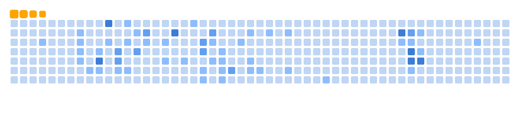
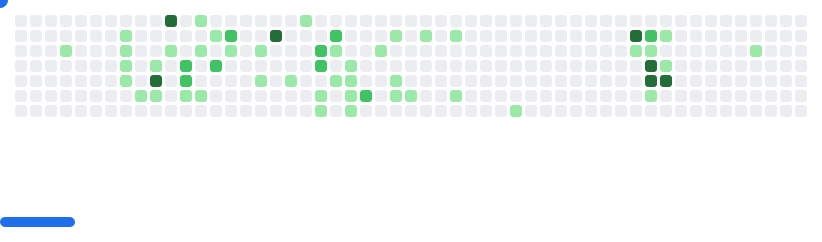

  
  <strong>Welcome to my GitHub profile! Let's innovate and build together. 🚀</strong>

I'm a **Computer Science Engineering Graduate** from **College of Engineering Poonjar, Kottayam**, with a passion for **game development**, **web development**, and **innovative tech solutions**. 🚀

---

### 🛠️ **What I'm Currently Working On:**

---

### Experience:
- **Graduate Trainee at Dbiz.ai** (May 2025 - Present ): Focusing on cloud storage and full scale development.
- **C# Developer Intern at Global Health Opinions** (Mar 2025 - May 2025 ): Hybrid internship focusing on integrating abha on our healthcare app.
- **Unity Developer Intern at PlatypusBox** (Nov 2024 - Feb 2025): Remote internship focusing on Unity development, cloud storage integration, and collaborative game development.
- **Technology Lead at IEDC, CE Poonjar** (Oct 2023 - Feb 2025): Leading technical initiatives, mentoring students, and guiding projects that promote innovation and entrepreneurship at the college.

---

# 💻 Tech Stack:
                                

---

### 📚 **What I'm Learning:**
- 🎮 Mastering **Unity** and **OpenCV**.
- 💻 Exploring **Django** and **Python** for web development.
- 🛠️ Enhancing my **programming and problem-solving skills**.
- 🎓 Expanding knowledge in **full-stack development**, and **server-side technologies**.

---

## 🌐 Socials:
 
 
 
 
 

---

# 📊 GitHub Stats:
 
 

--- 

### 🔝 Top Contributed Repo

---

### 🤝 **Let's Collaborate:**
- Open to collaborating on **game development projects**, **web apps**, and **innovative tech solutions**.

---

  ## 💰 You can help me by Donating
   

_This README is a snapshot of my journey — let's build something amazing together! 🚀_

<picture>
  <source media="(prefers-color-scheme: dark)" srcset="images/github-snake-dark.svg" />
  <source media="(prefers-color-scheme: light)" srcset="images/github-snake.svg" />
  
</picture>

<picture>
  <source media="(prefers-color-scheme: dark)" srcset="images/breakout-dark.svg" />
  <source media="(prefers-color-scheme: light)" srcset="images/breakout-light.svg" />
  
</picture>

